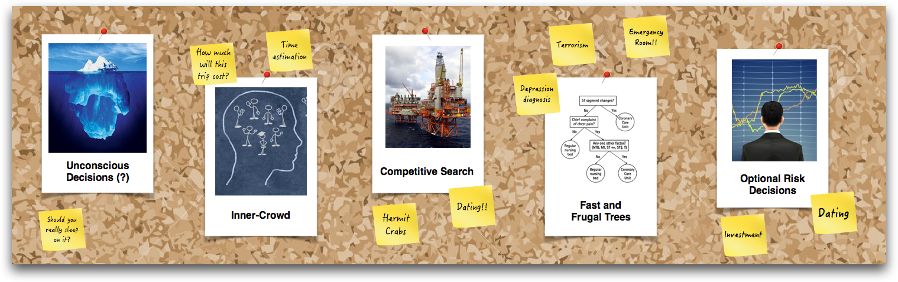

*Note: This page is under construction!*

```{r, out.width = "1000px", echo = FALSE, eval = TRUE, fig.align='center'}

```

### Unconscious decision making

If you have to make a difficult decision, should you think carefully, or sleep on it and let your unconscious mind do the work? An intriguing theory called Unconscious Thought Theory (UTT)  suggests that, indeed, you should let your unconscious mind do the work. The theory suggests that when you distract yourself from a difficult decision, your unconscious mind will process all the information necessary to make the decision and then reveal the best choice. We tested the predictions of this theory in several papers and find poor support for the theory. In *The delibaration-without-attention effect evidence for an artifactual interpretation* [@lassiter2009deliberation], we find that previous resarch showing a benefit to `unconscious thought' may not have been due to unconscious processing at all. We make the same conclusions in two additional papers [@gonzalez2010predicting; @gonzalez2014early].

### Wisdom of crowds within one mind: "Inner Crowd"

How can people make better judgments and decisions? One way is to combine estimates from a large group of diverse people. We know from extensive research that the average judgment from a crowd can be incredibly accurate -- even more so than the most accurate individual person. This phenomenon is known as the *wisdom of crowds* [@surowiecki2005wisdom]. However, relying on a crowd is not very practical in most real world decisions as it would require people to take a massive survey every time they want to make a decision. But can a person benefit from a wisdom of crowds within one mind -- an "inner-crowd"? Indeed, recent research has shown they can [@vul2008measuring;@herzog2009wisdom].

In *Improving Bayesian reasoning with the inner-crowd* [@phillips2016bayesian] we explore how people can use an inner-crowd to improve judgments in Bayesian reasoning tasks. 

In *Utilizing confidence in the inner-crowd* [@phillips2016confidence], we explore how people can and should use confidence to boost the benefits of their inner-crowd: 


### Competition and decisions under uncertainty

How should you change your decision making process when you are competing with other people in a complex, uncertain environment?

In *Rivals in the dark: How competition influences decisions under uncertainty* [@phillips2014rivals] we introduce a new experimental paradigm called the *Competitive Sampling Game (CSG)* to measure the effects of competition on information search. Using the paradigm, we find that competition causes people to *dramatically* reduce their pre-decisional information search.


### Fast and frugal decision trees


### Optional risk decisions from experience


# References